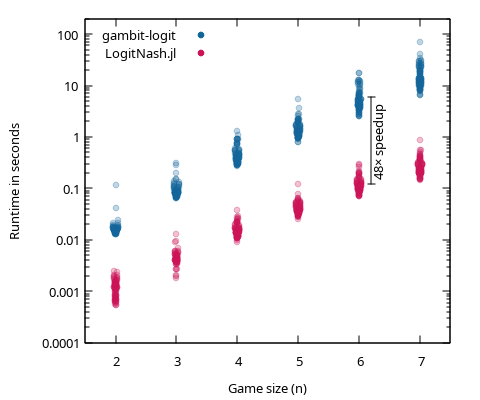
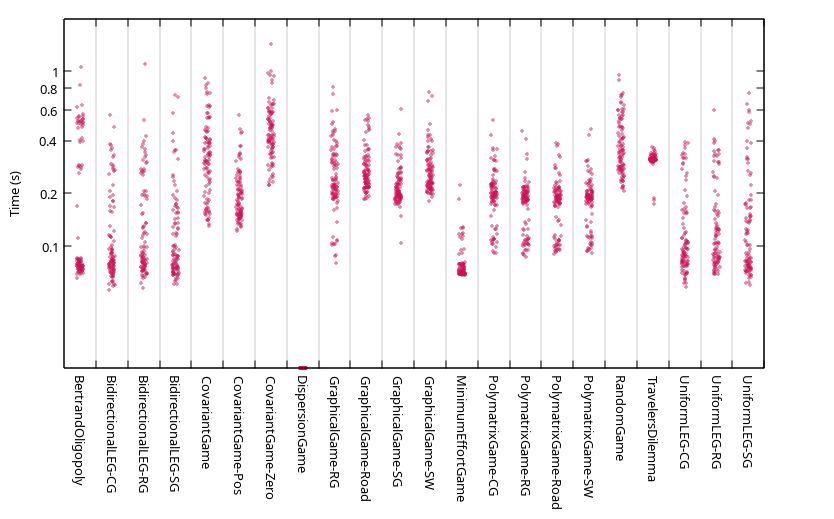
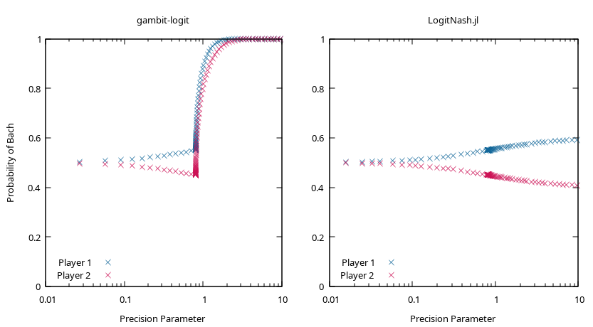

# LogitNash.jl


> [!WARNING]
> Package is not registered yet -- it is minimally tested, the code quality is low, and the API is not stable!
<!-- or at least I think so, singe github CI is broken again...-->

Compute a mixed $\epsilon$-Nash equilibrium of an N-player game by tracing a logit equilibrium path satisfying

$$
\pi_{ij} = \frac{e^{tu_i(j,\pi_{-i})}}{\sum_k e^{tu_i(k,\pi_{-i})}}
$$

from a uniform profile at $t=0$ to a generically unique Nash equilibrium at infinity.

The algorithm stops when either:
 - ($\epsilon$-NE condition) there is no unilateral deviation from `pi` more profitable than `stop_eps`,
 - (logit condition) a solution is found for the precision parameter `t` greater or equal to `stop_t`,
 - or the maximum number of iterations of `stop_iters` is reached.

## Speed and Stability

This implementation tries to improve on the speed and stability of `gambit-logit`. On randomly-generated (normally-distributed) five-player general-sum games with up to seven actions per player, the speedup can be significant:



a representative slate of 22 distributions from GAMUT for six-player five-action games is shown below.



Note that this is not a direct port of `gambit-logit`. The path following algorithm, as well as the profile encoding is different. Compare the path tracing behavior on the game of Bach or Stravinsky:



## Install

Install the package directly from GitHub by running:
```julia
using Pkg; Pkg.add(url="https://github.com/votroto/LogitNash.jl")
```

## Usage

The following example solves a three-player prisoners dilemma
```julia
using LogitNash

p1 = Float64[3 1; 5 2;;; 1 0; 2 1]
p2 = Float64[3 5; 1 2;;; 1 2; 0 1]
p3 = Float64[3 1; 1 0;;; 5 2; 2 1]
three_prisoners = (p1, p2, p3)

pi, status = nash(three_prisoners; stop_iters=1000, stop_t=1e6, stop_eps=1e-6)

for p in eachindex(pi)
    println("pi_$p = ", round.(pi[p]; digits=5))
end
```
which should result in the strategy profile
```julia
pi_1 = [0.0, 1.0]
pi_2 = [0.0, 1.0]
pi_3 = [0.0, 1.0]
```

## Notes
- *The project is a work-in-progress. Feedback is welcome, so is help.*
- *The Jacobian Kernels are specialized per the number of players. The first time an N-player game is solved will incur a compilation time penalty.*
- *There is no specialization for zero-sum games. A reasonable linear program will always be faster.*

## TBD

There is still room for improvement.

 1. There is currently no endgame implemented. Increasing the target precision parameter significantly past $10^6$ increases the likelihood of failure due to floating-point noise. A switch to a complementarity-based formulation could quickly improve the NE approximations by two orders of magnitude.
 2. The Jacobians are recomputed at every Newton iteration.
 3. There are a lot of pointless and repeated calculations in the algorithm.
 4. There is no parallelization (except for any done by BLAS/LAPACK).
 5. If the paths are smooth, the predictor can likely be improved massively.
 6. There is no pre-processing, such as removal of dominated strategies.
 7. All the kernels are optimized only for dense floating-point utilities.

## Acknowledgements

Many thanks go to `BifurcationKit.jl`, `HomotopyContinuation.jl`, `bertini`, `gambit-logit` for their source code and manuals; to ChatGPT for deriving the jacobians; to Gemini and GitHub Copilot for refactoring; to Mosek and Gurobi for their academic licences for testing, and to AIC for their inexplicable continued support.

Based on the papers:

> Turocy, T. L. (2005). A dynamic homotopy interpretation of the logistic quantal response equilibrium correspondence. *Games and Economic Behavior, 51*(2), 243–263. https://doi.org/10.1016/j.geb.2004.04.003

> Timme, S. (2021). Mixed precision path tracking for polynomial homotopy continuation. Advances in Computational Mathematics, 47, 75. https://doi.org/10.1007/s10444-021-09899-y
